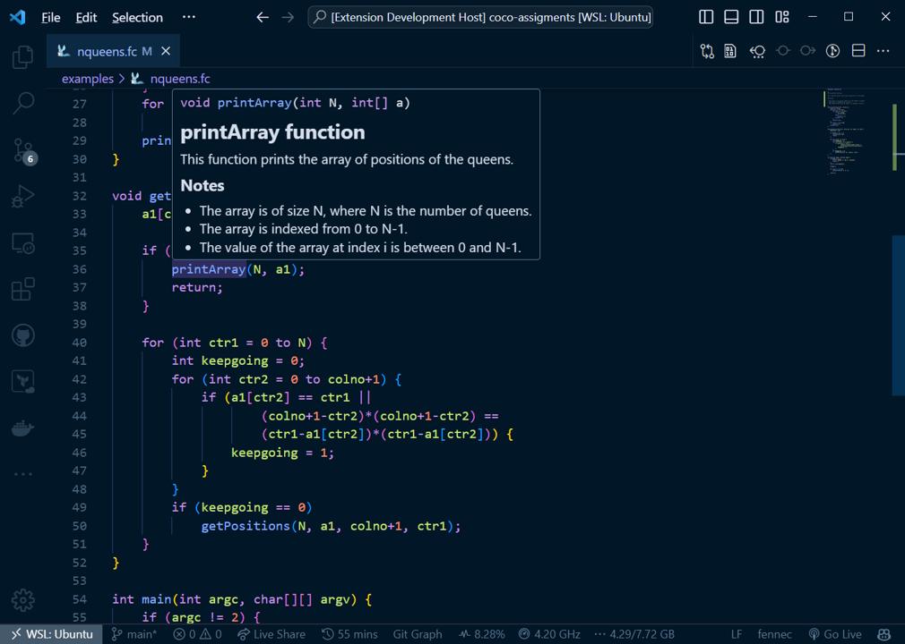

# FenneC Language Support

[**Repository**](https://github.com/KaiErikNiermann/fennec-vscode) **|** [**Issues**](https://github.com/KaiErikNiermann/fennec-vscode/issues) 

## Overview

This extension aims to provide full comprehensive language support for FenneC, including C-style syntax highlighting, code snippets for basic constructs, and some basic IntelliSense information. Hopefully, this can make working with the language both faster and easier.

## Features

- Mostly full C-style syntax highlighting 
- Snippets for basic constructs 
- Basic C-style IntelliSense for functions including hover and autocomplete

## Known Issues

If you come across any problems/issues or have suggestions for enhancements, please don't hesitate to [raise them here](https://github.com/KaiErikNiermann/fennec-vscode/issues).

## Contributing 

Since FenneC is a mainly educational language this extension is very much made by students for students. Any contributions are greatly appreciated, if you want to know where to get started helping checkout the [contributing guide](https://github.com/KaiErikNiermann/fennec-vscode/blob/main/CONTRIBUTING.md). 

## Release notes

Information about new releases is documented in the [changelog](https://github.com/KaiErikNiermann/fennec-vscode/blob/main/CHANGELOG.md) on the project github.

## Acknowledgements

The artist for the wonderful FenneC mascot is [Mei-Li Nieuwland](https://liea.nl/).

The FenneC language and its specification are inspired by (but not related to) the CiviC language which was invented by [Clemens Grelck](https://staff.science.uva.nl/c.u.grelck/) for the Compiler Construction course taught at the University of Amsterdam.

Finally credit to the teaching staff of the [Compiler Construction course](https://studiegids.vu.nl/en/Bachelor/2023-2024/computer-science/XB_0003#/) at VU Amsterdam for creating such an interesting course. I hope this extension can help people have as much fun with the assignments and the language as I did.